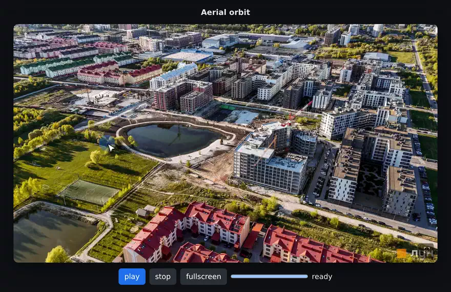

# spindle

[](https://www.npmjs.com/package/@tegos/spindle)
[](https://bundlephobia.com/package/@tegos/spindle)
[](https://www.npmjs.com/package/@tegos/spindle)
[](./LICENSE)
[](https://tegos.github.io/spindle/)

<p align="center">
  <a href="https://tegos.github.io/spindle/">
    
  </a>
</p>

360° frame-sequence spinner for the web — object spins and aerial orbits.
Vanilla TypeScript, **zero runtime dependencies**, single `<canvas>` render.

A modern rewrite of an old jQuery + SpriteSpin viewer (e.g. lun.ua drone
flyovers of a building complex). Viewer only — bring your own frames.

## Features

- Frame source: individual image URLs **or** a sprite sheet
- Progressive loading: paints frame 1 and becomes interactive early, streams the rest (`onProgress` / `onReady`)
- Drag + touch with momentum/inertia and wraparound looping
- Autoplay until the user grabs
- Zoom (pinch / scroll / double-tap) + pan within the current frame
- Fullscreen toggle
- ESM + UMD builds with type definitions

## Install

```bash
npm install @tegos/spindle
```

## Usage

```ts
import { Spindle } from '@tegos/spindle'

const s = new Spindle('#jk-avalon', {
  source: ['lun/1.jpg', 'lun/2.jpg', /* … */], // or { sheet, frames, fw, fh }
  autoplay: true,
  loop: true,
  momentum: true,
  zoom: true,
  fullscreen: true,
  onProgress: (p) => console.log(`${Math.round(p * 100)}%`),
  onReady: () => console.log('ready'),
})

s.goto(12)
s.play()
s.stop()
s.fullscreen()
s.destroy()
```

The target element needs a size from CSS; spindle fills it.

### Sprite sheet source

```ts
new Spindle('#viewer', {
  source: { sheet: 'orbit.jpg', frames: 36, fw: 800, fh: 450, cols: 6 },
})
```

## Options

| Option | Default | Meaning |
|---|---|---|
| `source` | — | Frame URLs `string[]` or `{ sheet, frames, fw, fh, cols? }` (required) |
| `autoplay` | `false` | Spin on load until grabbed |
| `loop` | `true` | Wrap around at the ends |
| `momentum` | `true` | Fling with inertia on release |
| `zoom` | `true` | Pinch / scroll / double-tap zoom + pan |
| `fullscreen` | `true` | Show a fullscreen toggle |
| `pxPerFrame` | `8` | Drag pixels per frame step |
| `autoplayFps` | `12` | Frames/sec during autoplay |
| `maxZoom` | `4` | Max zoom factor |
| `onProgress(p)` | — | Load progress `0..1` |
| `onReady()` | — | First frame painted, interactive |

## API

`new Spindle(target, options)` — `target` is a selector or element.

- `goto(i)` — jump to a frame (wrapped or clamped per `loop`)
- `play()` / `stop()` — start / stop autoplay
- `fullscreen()` — toggle fullscreen
- `resetZoom()` — back to fit view
- `destroy()` — tear down listeners and DOM
- `frame` (get) — current frame index
- `length` (get) — total frames

## Develop

```bash
npm install
npm run dev      # vite dev server doubles as the examples (examples/)
npm test         # vitest
npm run build    # dist/: ESM + UMD + .d.ts
```

## Examples

`npm run dev` serves `examples/` (vite) with two viewers:

- **Aerial orbit** — drone flyover of ЖК Avalon Holiday
- **Product spin** — object turntable

Demo frames are **for demonstration only** — see the `CREDITS.md` next to each
set. Aerial frames are a drone flyover from
[lun.ua](https://lun.ua/uk/жк-avalon-holiday-сокільники/аерообліт); the product
turntable is a generic sample found online (source unknown, unaffiliated with
lun.ua). Supply your own frames for production use.

## License

MIT (code only — see demo frame credits above).
